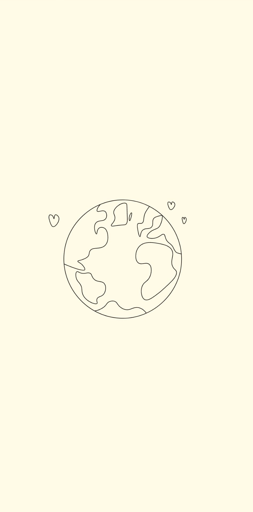
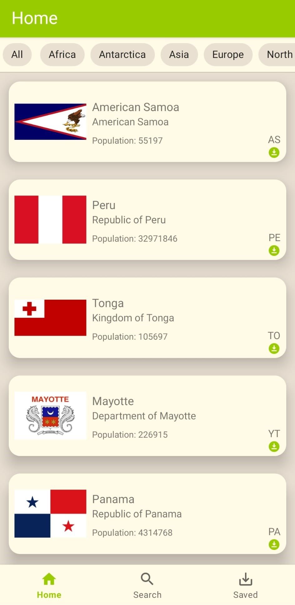
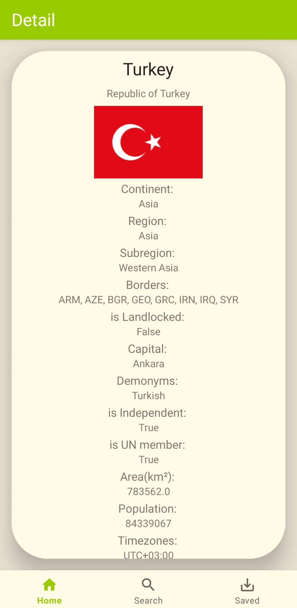

# CountriesApp

This project is an application that displays country information on Android platform using RESTCountries API. The application is built on the single activity multiple fragments architecture and was developed using the MVVM design pattern.

## Screenshots

Splash Screen:

Home Screen:

Detail Screen:

## Features

- An impressive SplashScreen animation is shown when the application is launched and redirects to the Home Page after a certain amount of time or after the animation is completed.
- On the Main Page, the country information is displayed as small cards on the RecyclerView with the data received from the RESTCountries API. When the device is in an upright position, 1 country card is arranged, while in a horizontal position, 2 country cards are arranged side by side.
- User can dynamically change country information using API's filtering endpoints or code-specific filtering.
- When any country card is clicked on the Home Page, navigation is made to the Detail Screen and detailed information about the country is displayed on this screen.
- Country names can be searched in the application and search queries are stored as History information. The user can view previous searches as an option when he clicks on the search field.

## Technologies and Libraries Used

- MVVM architecture is used.
- Observation of data is provided with LiveData, StateFlow and SharedFlow.
- Kotlin Coroutines are used to facilitate asynchronous data processing.
- DataBinding is used to bind data with UI elements.
- RecyclerView is used in list display where country information is listed.
- ConstraintLayout and LinearLayout are preferred for creating screen layouts.
- NavigationComponent and SafeArgs are used for switching between screens and data transfer.
- RoomDB used local database to store call history information.
- Retrofit is preferred for RESTCountries API requests.
- Gson is used in serializing API data.
- Glide is preferred for loading country flags.
- Hilt Dependency Injection was used to inject dependencies.
- UseCase was used to organize the application business logic.

## How to Start?

1. Clone this project: `git clone https://github.com/AtakannD/CountriesApp.git`
2. Open Android Studio.
3. Select 'Open' from the 'File' menu and find and open the project.
4. Start the emulator or your Android device.
5. Run the application by pressing the 'Run' button.

## Additional Notes

- While developing the project, Android Studio Flamingo version was used.
- The application requires internet connection in API queries. Please make sure your emulator has internet connection.

## Contribute

This project is open source and I welcome your contributions! You can report your suggestions and errors for a better application. Please create an issue in the 'Issues' section or submit a pull request directly.
